# Arquitectura RAG en Azure AI Search
**Fase de Embeddings y Vector Database — Guía Técnica**


**Autor:** Adnan Hamidoun El Habti


---

## 1. Resumen ejecutivo

Este documento constituye la **Parte 1** de la implementación de una arquitectura de recuperación de información aumentada (RAG) sobre Azure AI Search. Se documenta la configuración completa del pipeline de indexación automatizado mediante el asistente del portal de Azure, cubriendo las fases de ingesta de documentos, fragmentación semántica, vectorización y despliegue de un índice optimizado para búsquedas híbridas y semánticas.

El entregable describe la infraestructura aprovisionada, los componentes creados automáticamente por el asistente de importación y la validación operativa del proceso de extremo a extremo.

---

## 2. Preparación del entorno
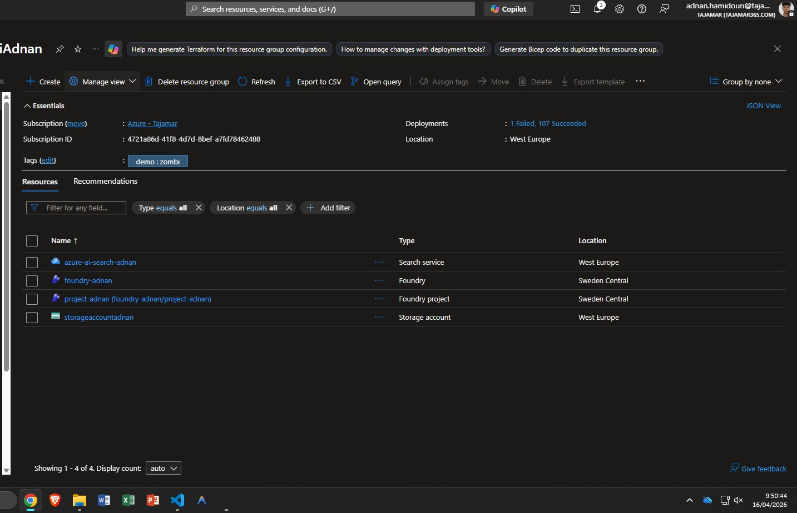
### 2.1 Estrategia de corpus

Para garantizar un entorno de pruebas controlado y determinista se descartó el uso de documentos PDF con estructuras de maquetado complejas. En su lugar, se construyó un corpus sintético compuesto por 10 archivos de texto plano (`.txt`) con alta densidad técnica, diseñados específicamente para forzar el comportamiento de chunking del pipeline.

### 2.2 Script de generación del corpus

```python
import os

folder_name = "rag_corpus"
if not os.path.exists(folder_name):
    os.makedirs(folder_name)

technical_topics = {
    "rag_architecture":    "Retrieval-Augmented Generation (RAG) optimizes LLMs by retrieving data from external sources.",
    "vector_embeddings":   "Embeddings transform words into numerical vectors within a multidimensional latent space.",
    "azure_ai_search":     "Azure AI Search is a search engine supporting vector indexing and enterprise-grade semantic ranking.",
    "hnsw_algorithm":      "The HNSW algorithm allows for nearest neighbor searches with ultra-low latency.",
    "data_cleaning":       "The quality of an AI system depends directly on the preprocessing and cleaning of input data.",
    "transformer_models":  "The Transformer architecture uses attention mechanisms to process data sequences in parallel.",
    "index_management":    "A well-configured cloud index must balance storage cost and retrieval speed.",
    "cloud_security":      "Using Managed Identities in Azure eliminates the need to store access keys in source code.",
    "batch_processing":    "Batch processing allows for handling massive data volumes at scheduled intervals.",
    "data_visualization":  "Tools like Power BI allow transforming complex data into actionable business insights."
}

for i, (titulo, contenido) in enumerate(technical_topics.items(), 1):
    file_path = os.path.join(folder_name, f"{i:02d}_{titulo}.txt")
    with open(file_path, "w", encoding="utf-8") as f:
        f.write(f"TECHNICAL DOCUMENTATION REGARDING {titulo.upper()}\n\n")
        f.write((contenido + " ") * 100)

print("Proceso finalizado. Archivos listos para el Blob Storage.")
```

El corpus generado replica la estructura de un repositorio de documentación corporativa. La repetición del contenido base por factor `x100` garantiza que cada archivo supere el umbral de fragmentación del `SplitSkill`, validando el comportamiento del chunking bajo condiciones reales de volumen.

### 2.3 Carga en Azure Blob Storage

Los 10 archivos se cargaron en un contenedor de Azure Blob Storage, configurado como origen de datos para el pipeline de indexación. Este contenedor actúa como la base de conocimiento primaria del sistema RAG.

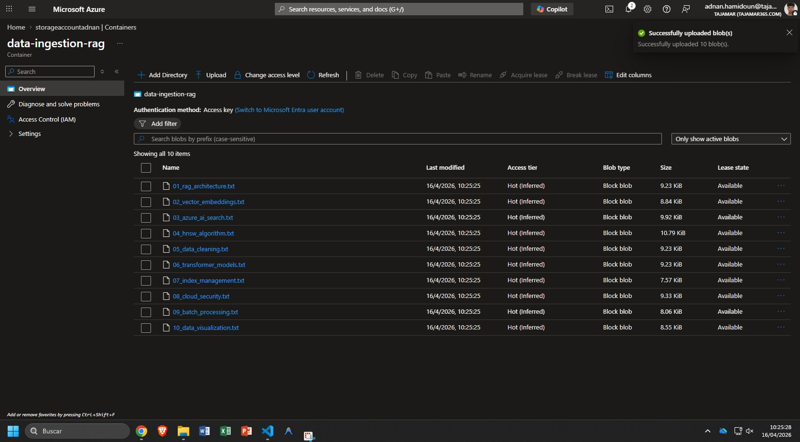


## 3. Pipeline de ingesta — Import and Vectorize Data

El aprovisionamiento de la base de datos vectorial se orquestó a través del asistente **Import and vectorize data** del portal de Azure AI Search, cubriendo las siguientes fases secuenciales:

### Fase 1 — Inicialización

Dentro del recurso de Azure AI Search se seleccionó la opción **Import and vectorize data**, eligiendo el escenario RAG estándar (sin agentic retrieval). Esta elección determina la topología del pipeline: indexador, conjunto de habilidades y esquema del índice se generan automáticamente con una configuración base optimizada para búsqueda híbrida.


### Fase 2 — Conexión de datos (Data Source)

| Parámetro | Valor configurado |
|---|---|
| Origen | Azure Blob Storage |
| Método de autenticación | System-assigned Managed Identity |
| Proveedor de identidad | Microsoft Entra ID |
| Seguimiento de eliminaciones | Native blob soft delete — activado |
| Detección de layout | Deshabilitada (archivos `.txt` planos) |

La autenticación mediante **Managed Identity** elimina la necesidad de gestionar credenciales explícitas. Azure delega la autorización a Entra ID, aplicando el principio de mínimo privilegio sin exponer claves de acceso en el código ni en la configuración del indexador.


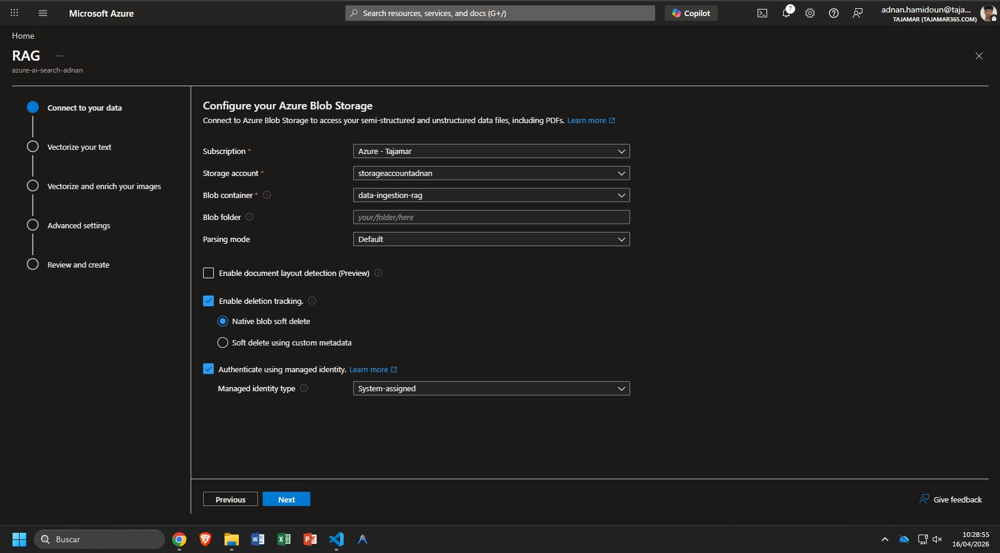
<div align="center"><em>Configuración del modelo de embeddings y parámetros de vectorización</em></div>

### Fase 3 — Vectorización

| Parámetro | Valor configurado |
|---|---|
| Proveedor de embeddings | Azure OpenAI |
| Modelo de embeddings | `text-embedding-3-small` |
| Despliegue | Azure AI Foundry |
| Extracción de texto de imágenes (OCR) | Deshabilitada |

El modelo `text-embedding-3-small` transforma cada fragmento de texto en un vector de **1536 dimensiones** en el espacio latente. Se descartó la activación del OCR dado que el corpus consiste íntegramente en archivos de texto plano, optimizando el consumo de recursos de procesamiento.


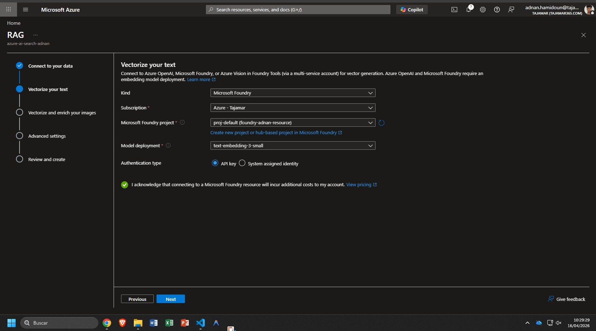
<div align="center"><em>Validación y configuración avanzada del índice</em></div>

### Fase 4 — Validación y configuración avanzada

El asistente infirió automáticamente el esquema del índice a partir de la estructura de los documentos, generando los campos léxicos y vectoriales necesarios. Adicionalmente, se habilitó el **Semantic Ranker** para enriquecer la precisión de recuperación en las consultas de producción.

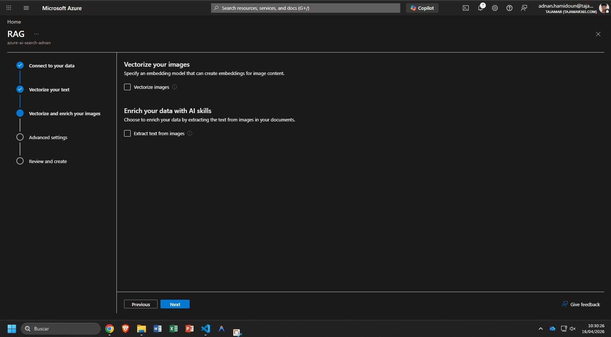
<div align="center"><em>Esquema de campos léxicos y vectoriales del índice</em></div>

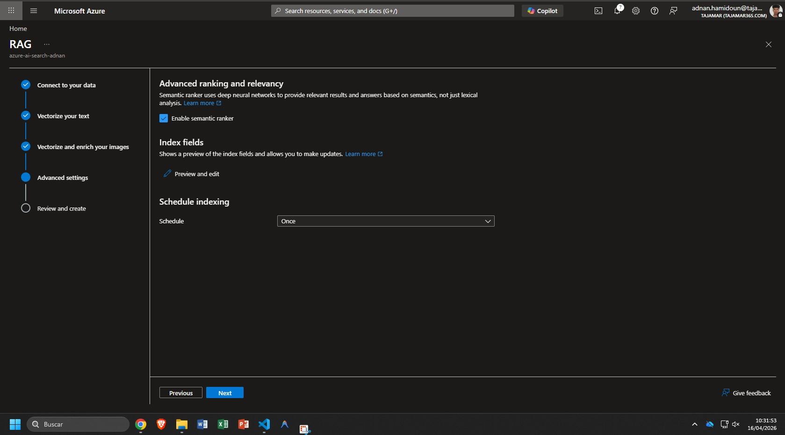
<div align="center"><em>Configuración semántica del índice</em></div>

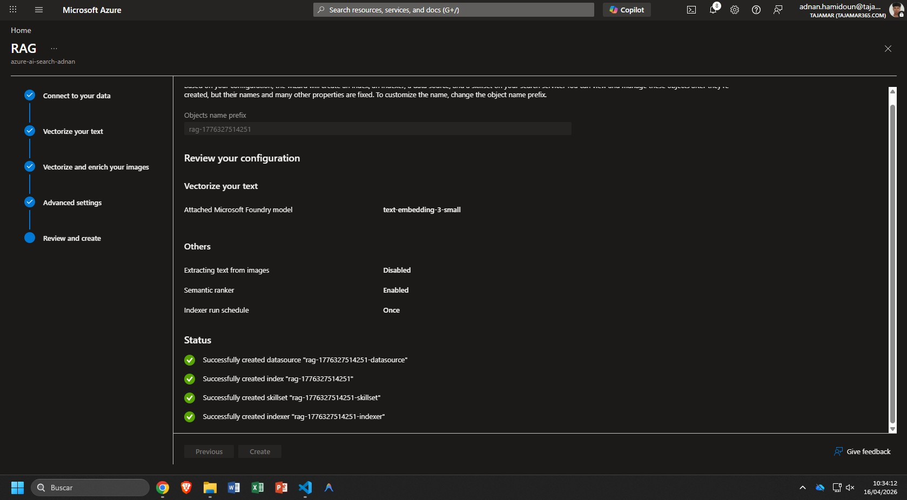
<div align="center"><em>Monitorización y validación del proceso de indexación</em></div>


## 4. Análisis técnico de componentes

El asistente de importación despliega automáticamente la infraestructura subyacente. A continuación se documenta cada componente con su rol funcional dentro de la arquitectura RAG.


### 4.1 Esquema del índice


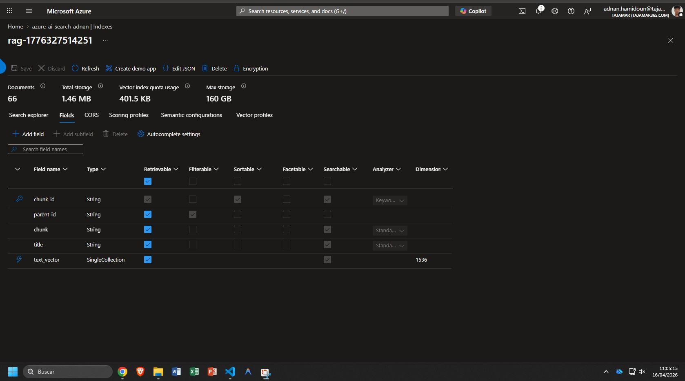


El esquema del índice, según la configuración real mostrada en la captura, está compuesto por los siguientes campos:

- **chunk_id** (`String`): Identificador único de cada fragmento o chunk. Es recuperable y searchable, y utiliza un analizador de tipo keyword.
- **parent_id** (`String`): Identificador del documento original al que pertenece el chunk. Es recuperable, filterable y sortable.
- **chunk** (`String`): Contenido textual del fragmento. Es recuperable y searchable, con analizador estándar.
- **title** (`String`): Título asociado al fragmento o documento. Es recuperable y searchable, con analizador estándar.
- **text_vector** (`SingleCollection`): Vector numérico (embedding) asociado al chunk, con una dimensionalidad de 1536. Es recuperable y habilita la búsqueda vectorial.

Este diseño permite búsquedas híbridas: por texto (BM25) y por similitud semántica (HNSW sobre el campo vectorial). Los campos están configurados para optimizar tanto la recuperación léxica como la semántica, y el uso de propiedades como `filterable` y `sortable` facilita consultas avanzadas y filtrado eficiente.


### 4.2 Configuración semántica

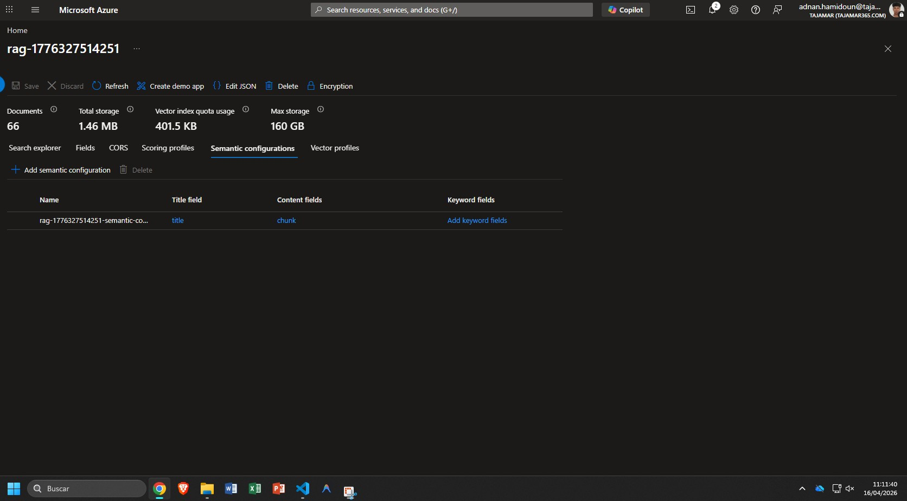


La configuración semántica define la política de re-ranking que se aplica sobre los resultados iniciales de búsqueda. Actúa como una **capa de inteligencia secundaria (L2)** que evalúa los fragmentos recuperados en función de la intención real de la consulta, no solo de la coincidencia de términos.

Técnicamente, el Semantic Ranker aplica modelos de comprensión lectora de Microsoft (basados en Transformers) para puntuar qué tan bien responde cada fragmento a la pregunta original. La configuración especifica qué campos del esquema (`content`, `title`) tienen mayor peso semántico en esa evaluación, ordenando los resultados por relevancia inferida en lugar de por relevancia estadística.

Este mecanismo mitiga los falsos positivos de la búsqueda vectorial pura, donde vectores geométricamente próximos no siempre corresponden a respuestas semánticamente adecuadas para la consulta concreta del usuario.

### 4.3 Perfil vectorial

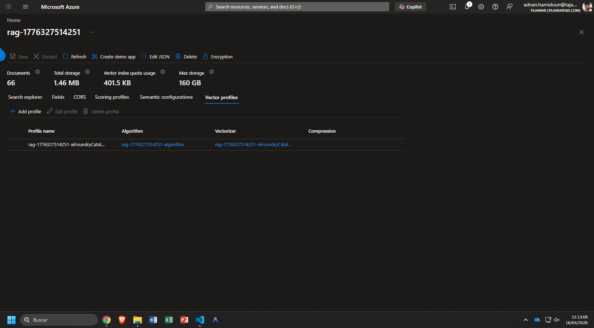
El perfil vectorial define las reglas matemáticas y operativas para la búsqueda aproximada de vecinos más cercanos. Se compone de dos elementos independientes:

**Algoritmo HNSW (Hierarchical Navigable Small World)**

En lugar de ejecutar una comparación exhaustiva del vector de búsqueda contra la totalidad de los vectores del índice —inviable en producción por la complejidad lineal O(n)—, HNSW construye un **grafo jerárquico multinivel** durante la fase de indexación. Cada nodo del grafo representa un vector; los enlaces entre nodos aproximan las relaciones de vecindad en el espacio de alta dimensión.

En tiempo de consulta, el algoritmo navega este grafo desde las capas superiores (más abstractas) hasta las inferiores (más granulares), convergiendo hacia los candidatos más cercanos al vector de búsqueda en milisegundos. Este enfoque implementa **Approximate Nearest Neighbor (ANN)**, aceptando un margen controlado de imprecisión a cambio de latencia sublineal.

**Vectorizador**

El vectorizador es el módulo de integración en tiempo real que hace el proceso transparente para la aplicación cliente. Cuando el usuario lanza una consulta en texto libre, el vectorizador intercepta esa cadena, invoca la API del modelo `text-embedding-3-small`, obtiene el vector de 1536 dimensiones correspondiente y lo pasa al motor HNSW para la búsqueda. La aplicación cliente no necesita gestionar la transformación: envía texto y recibe documentos ordenados por relevancia.

### 4.4 Conjunto de habilidades (Skillset)

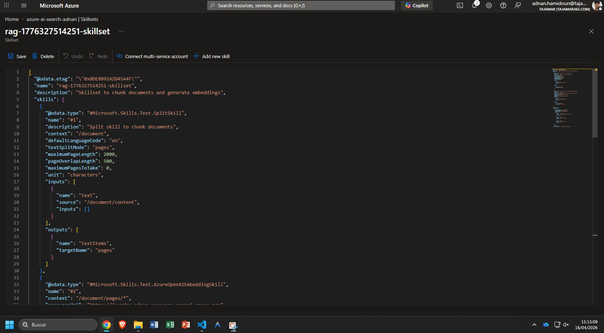

El Skillset es el **pipeline ETL impulsado por IA** que se ejecuta durante la ingesta de cada documento. Orquesta la transformación del dato en bruto en conocimiento estructurado e indexable, con dos habilidades secuenciales críticas:

**SplitSkill — Fragmentación de documentos (Chunking)**

Divide cada archivo en segmentos de texto de tamaño controlado, con un margen de solapamiento configurable entre fragmentos consecutivos. El chunking es un requisito estructural de la arquitectura RAG por dos razones:

- Los modelos de lenguaje tienen una ventana de contexto máxima. Un documento de varias páginas no puede enviarse íntegro al modelo en la fase de generación.
- La densidad semántica de un párrafo es mayor que la de un documento completo. Fragmentar mejora la precisión de recuperación porque el índice contiene unidades de información más coherentes y autónomas.

El solapamiento entre chunks garantiza que la información que cae en la frontera entre dos fragmentos no quede huérfana de contexto en ninguno de ellos.

**AzureOpenAIEmbeddingSkill — Vectorización de fragmentos**

Tras la fragmentación, esta habilidad itera sobre cada chunk resultante y ejecuta una llamada a la API del modelo `text-embedding-3-small`. La respuesta —un vector de 1536 valores de punto flotante— se persiste en el campo `content_vector` del índice. Este proceso convierte el corpus textual en una **base de datos vectorial** consultable por similitud geométrica en el espacio latente.


### 4.5 Monitorización de ejecución (Indexer)

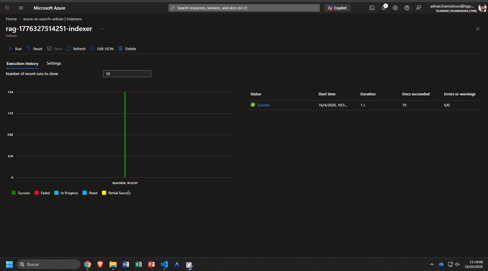

El indexador es el motor de orquestación que ejecuta el flujo de trabajo completo de forma programada o bajo demanda. La captura del estado de ejecución constituye la **validación operativa** de toda la arquitectura:

- Conexión segura al origen de datos mediante Managed Identity sin credenciales explícitas.
- Extracción de los 10 documentos sintéticos del contenedor de Blob Storage.
- Aplicación del Skillset completo: fragmentación por `SplitSkill` y vectorización por `AzureOpenAIEmbeddingSkill`.
- Ausencia de errores de timeout ni de throttling en la API de embeddings.
- Volcado de los documentos procesados en el índice de búsqueda, listos para ser consultados.

El estado `Success` con los 10 documentos contabilizados cierra el ciclo de la Parte 1 y habilita la fase de consulta que se documenta en la Parte 2 de este entregable.

---

## 5. Arquitectura desplegada — Diagrama de componentes

```
Azure Blob Storage
        |
        | (Managed Identity)
        v
   [ Indexador ]
        |
        v
  [ Skillset ]
   |         |
   v         v
SplitSkill  AzureOpenAIEmbeddingSkill
(Chunking)  (text-embedding-3-small)
                   |
                   | 1536-dim vectors
                   v
         [ Azure AI Search Index ]
          ___________________________
         |  Campos léxicos (BM25)   |
         |  Campo vectorial (HNSW)  |
         |  Semantic Ranker (L2)    |
         |__________________________|
                   |
         (Búsqueda híbrida + RRF)
                   v
              Aplicación RAG
```


---

## 6. Conclusión


La solución desplegada permite la ingesta, procesamiento y consulta eficiente de información técnica en Azure, combinando búsquedas léxicas y semánticas. El pipeline es fácilmente extensible y auditable, y la monitorización asegura la trazabilidad de todo el proceso. Esta arquitectura es una base sólida para escenarios avanzados de RAG y puede evolucionar hacia integraciones más complejas en futuras fases del proyecto.

---

## Continuación: Parte 2 - Práctica en Python


[Ir a la Parte 2: práctica_vector_search.ipynb](./Azure_Search_Vector_Hybrid_Semantic.ipynb)


