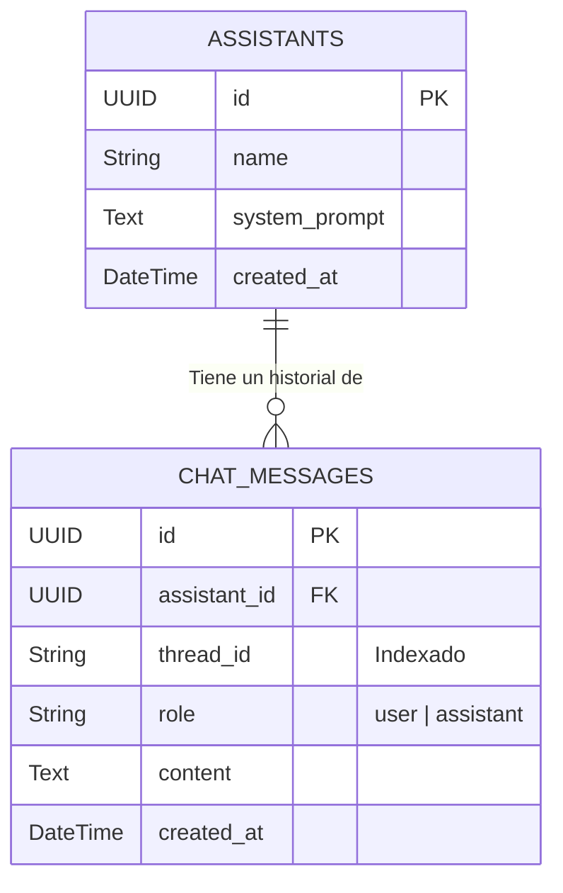

# Base de Datos e Índices Vectoriales 💾

Aisla-RAG se apoya en un patrón de bases de datos políglota: utiliza **Azure SQL** para datos transaccionales fuertemente consistentes (ACID) y **Azure AI Search** para operaciones vectoriales y semánticas de alto rendimiento.

[Volver al Inicio](../README.md) | [Ver Arquitectura](ARCHITECTURE.md) | [Ver Seguridad](SECURITY.md)

---

## 1. Modelo Transaccional (Azure SQL Serverless)

La base de datos relacional almacena el estado fundamental del sistema. Está gobernada mediante **SQLAlchemy 2.0**, utilizando mapeo declarativo fuertemente tipado. 

La relación principal se articula entre los Asistentes y el Historial de Chat.

### Diagrama Entidad-Relación

- **Cascadas (Delete-Orphan):** Si un asistente es eliminado del sistema, SQLAlchemy destruye automáticamente todos sus mensajes asociados a nivel base de datos para mantener la higiene de los datos.
- **Indexación `thread_id`:** Para asegurar tiempos de lectura sub-milisegundo en la memoria del chat, la columna `thread_id` se encuentra indexada nativamente.

---

## 2. Modelo Vectorial (Azure AI Search)

Mientras SQL retiene la lógica de negocio y las conversaciones, Azure AI Search actúa como el **"Cerebro Secundario"**, almacenando todo el conocimiento técnico fragmentado de los PDF corporativos.

### Definición del Índice: `asistentes-index`

| Campo | Tipo OData | Atributos | Propósito |
| :--- | :--- | :--- | :--- |
| `id` | `Edm.String` | Key | Identificador único del fragmento (Key del índice). |
| `assistant_id` | `Edm.String` | Filterable | Fundamental para la **Seguridad Multi-Tenant**. Permite ejecutar filtros booleanos exactos antes del vector search. |
| `content` | `Edm.String` | Searchable | El fragmento de texto puro (chunk) extraído del PDF. |
| `content_vector` | `Collection(Edm.Single)` | Searchable | Matriz flotante tridimensional (Embedding). |

### Algoritmo HNSW y Perfil Vectorial

- **Dimensiones:** `1536` (Optimizadas para el modelo `text-embedding-3-small` de OpenAI).
- **Métrica de Distancia:** Cosine Similarity (`cosine`). Cuantifica cuán alineados semánticamente están dos vectores de manera independiente de su magnitud.
- **Algoritmo de Búsqueda:** **HNSW** (Hierarchical Navigable Small World). 
  - *Justificación Técnica:* HNSW es un algoritmo basado en grafos multicapa. A diferencia de un escaneo de fuerza bruta (Exhaustive KNN), HNSW permite tiempos de latencia ínfimos (cálculos logarítmicos) sin sacrificar la asombrosa precisión (Recall) del modelo RAG en grandes volúmenes de contexto. Parámetros ajustados (m=4, efSearch=500) priorizan un Recall exhaustivo durante las consultas del usuario final.
