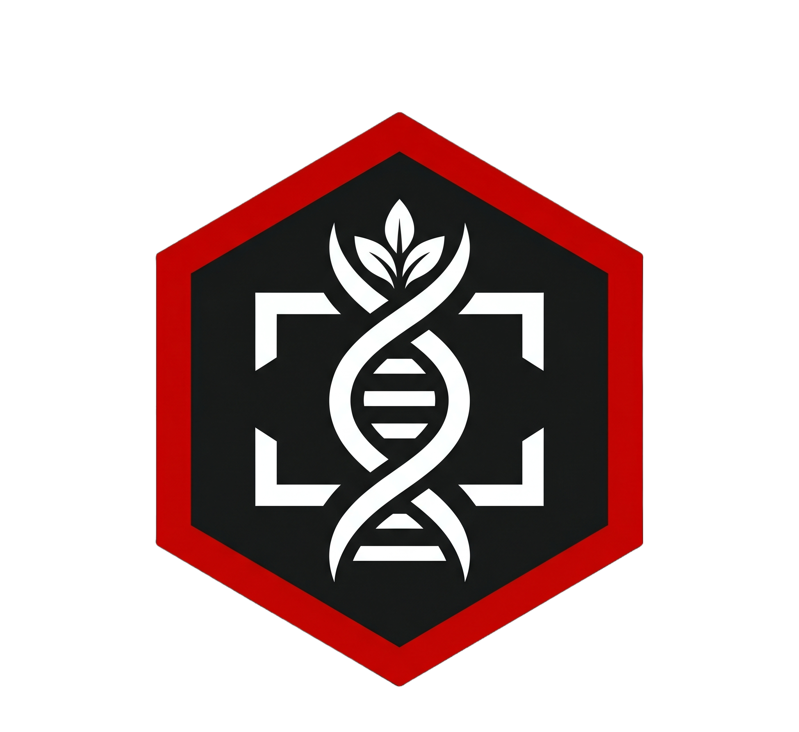
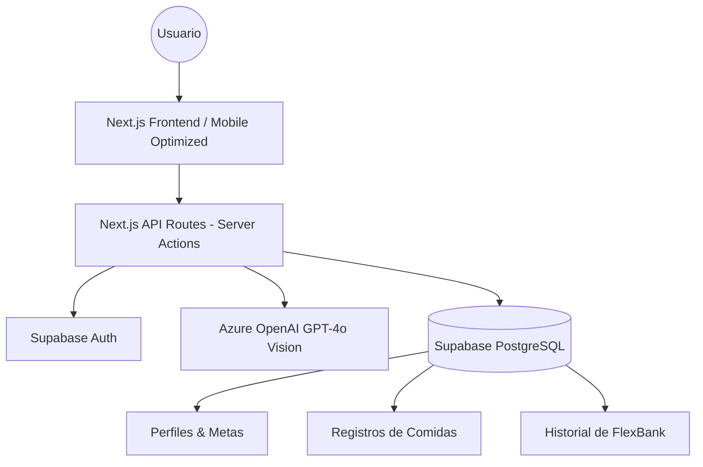

# DAIL Nutrition — Tu Nutricionista Inteligente (AI SaaS)



> **Transforma una simple foto en tu plan de combate metabólico.** DAIL Nutrition es una plataforma SaaS diseñada para la optimización física definitiva, utilizando IA Generativa de visión para analizar tu nutrición en tiempo real.

---

## 🚀 Descripción del Proyecto
DAIL Nutrition nace para resolver la fricción del registro nutricional tradicional. En lugar de buscar alimentos en bases de datos infinitas, el usuario simplemente **toma una foto**. Nuestra IA identifica los ingredientes, estima porciones, calcula macros (Proteína, Carbos, Grasas) y proporciona feedback de "Coaching Vital" instantáneo.

### El Problema
El 90% de las personas abandonan su dieta porque registrar lo que comen es aburrido, lento y complejo.

### La Solución
Una interfaz táctica "Dark Elite" optimizada para móvil que reduce el tiempo de registro de 3 minutos a **10 segundos**.

---

## 🛠️ Stack Tecnológico
- **Frontend**: [Next.js 15](https://nextjs.org/) (App Router, React 19)
- **Backend**: [Next.js API Routes](https://nextjs.org/docs/app/building-your-application/routing/route-handlers) (Edge Ready)
- **Base de Datos & Auth**: [Supabase](https://supabase.com/) (PostgreSQL + Realtime)
- **Estilos**: [Tailwind CSS](https://tailwindcss.com/) (Sistema de temas dinámico mediante variables CSS)
- **Animaciones**: [Framer Motion](https://www.framer.com/motion/)
- **IA Generativa**: [Azure OpenAI Service](https://azure.microsoft.com/en-us/products/ai-services/openai-service) (Modelo GPT-4o Vision)

---

## 🧠 Integración de IA Generativa
El núcleo de **DAIL Nutrition** es su **Motor de Visión Nutricional**. A diferencia de los chatbots genéricos, hemos implementado un pipeline de procesamiento de imágenes estructurado:

1. **Captura & Encoding**: La imagen se captura en el cliente y se envía como Base64 a nuestro servidor.
2. **Análisis de Visión (Vision-to-Struct)**: Utilizamos **GPT-4o Vision** con un *System Prompt* experto para identificar alimentos y estimar gramajes.
3. **Generación de JSON Estructurado**: La IA no responde con texto libre, sino con un esquema JSON preciso que incluye:
   - `calories`, `protein`, `carbs`, `fat`.
   - `health_tip`: Un consejo táctico basado en el perfil del usuario.
4. **Personalidad del Coach**: La IA adapta su tono (Disciplina Absoluta, Apoyo Equilibrado o Análisis Técnico) según la configuración del usuario en su perfil.

---

## ✨ Funcionalidades Principales
- **Snap & Track**: Análisis instantáneo de comidas mediante fotos.
- **Anillo de Energía (Energy Ring)**: Visualización dinámica de calorías restantes con estética de alto rendimiento.
- **Hucha Metabólica (FlexBank)**: Gestión de excedentes calóricos para permitir flexibilidad sin perder el progreso.
- **Marketplace de Temas**: Personalización completa de la interfaz (Elite Red, Neon Blue, Cyber Green, etc.).
- **Combat Archive (Historial)**: Línea de tiempo visual de todos tus registros con resúmenes diarios.
- **Onboarding Táctico**: Configuración de perfil basada en objetivos reales y advertencias de viabilidad (Reality Checks).

---

## 📐 Arquitectura Técnica
La aplicación sigue una arquitectura **Serverless / Edge First**:



---

## 💻 Guía de Despliegue Local

### Requisitos Previos
- Node.js 18.x o superior
- Cuenta en Supabase (Proyecto creado)
- Acceso a Azure OpenAI Service (API Key + Deployment de GPT-4o)

### Pasos de Instalación
1. **Clonar el repositorio**:
   ```bash
   git clone https://github.com/tu-usuario/dail-nutrition.git
   cd dail-nutrition
   ```

2. **Instalar dependencias**:
   ```bash
   npm install
   ```

3. **Configurar variables de entorno**:
   Copia el archivo de ejemplo y rellena tus credenciales:
   ```bash
   cp .env.example .env.local
   ```

4. **Ejecutar en desarrollo**:
   ```bash
   npm run dev
   ```

5. **Acceso**:
   Abre [http://localhost:3000](http://localhost:3000) en tu navegador (usa el modo inspección móvil para la mejor experiencia).

---

## 👥 Autores
- **Adnan** - *Arquitectura de IA & Frontend Elite*
- [Tu Compañero/a] - *Backend & Estrategia de Negocio*

---

## 💼 Propuesta de Valor (Business Pitch)
DAIL Nutrition se posiciona en el mercado de **Health & Fitness SaaS** con una diferenciación clara: la eliminación de la fricción. Mientras MyFitnessPal compite por la base de datos más grande, nosotros competimos por la **velocidad de registro**. 

**Modelo de Negocio**:
- **Freemium**: Registro básico y análisis de 3 fotos/día.
- **Elite Sub**: Análisis ilimitado, todos los temas del Marketplace desbloqueados y coaching de IA avanzado.

---
*Este proyecto ha sido desarrollado como Práctica Final para el curso de Desarrollo de Aplicaciones SaaS con IA Generativa.*
